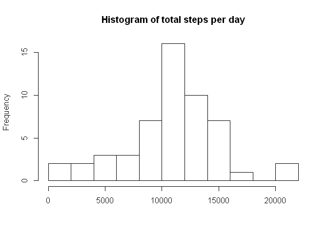
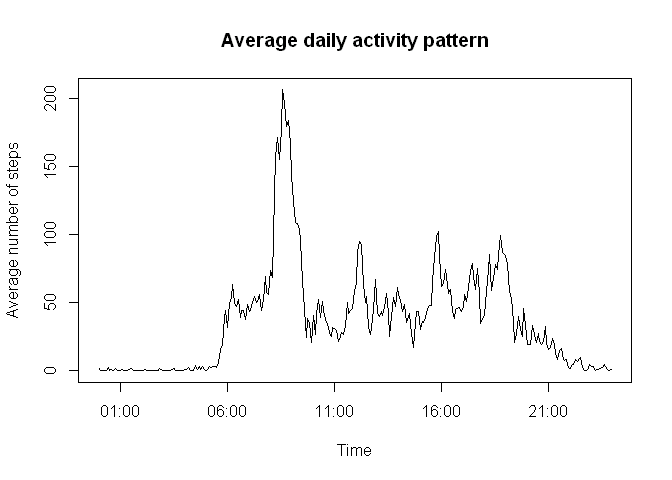
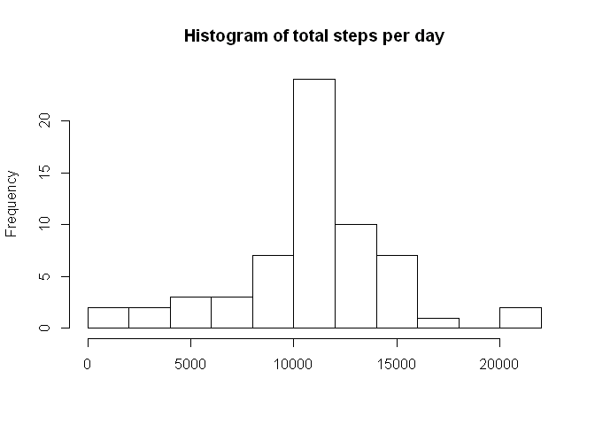
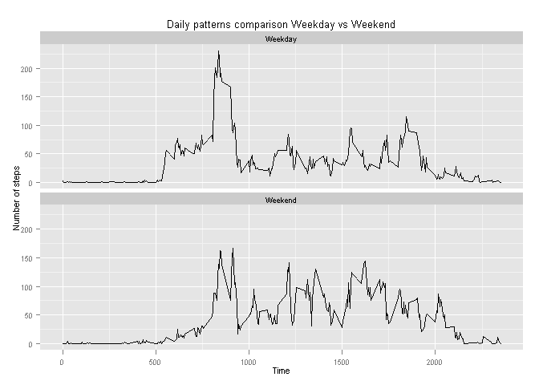

# Reproducible Research: Peer Assessment 1


## Loading and preprocessing the data

Data set from the study is in working directory as zip file, the data is unzipped and loaded into R. All libraries needed along the file are included.
No preliminary processing of the data is conducted due to the fact that treatment of  missing values changes along the study.


```r
# Including all required libraries
library(stats)
library(base)
library(ggplot2)

# Set language to english to avoid location ploblems in weekdays patterns 
Sys.setlocale("LC_TIME", "English")
```

```
## [1] "English_United States.1252"
```

```r
# Loading original data into data frame
unzip("activity.zip")
activity <- read.csv("activity.csv")
```

## What is mean total number of steps taken per day?

Original data is aggregated by date in order to computed total number of steps
per day. Missing values are removed. An Histogram is generated. Values for mean and median number of steps are computed. 


```r
# Generating the per day data set
activityDays <- aggregate(steps ~ date, data = activity, sum )
meanDays <- mean(activityDays$steps, na.rm = TRUE)
medianDays <- median(activityDays$steps, na.rm = TRUE)

# Generating the histogram
hist(activityDays$steps,
      breaks = 12,
      main = "Histogram of total steps per day",
      xlab = "")   
```

 

In this case we have a mean of 10766.19 steps and a median of 10765 steps.  
Histogram has a bell shape, resembling a normal distribution. Points in the right tail could corrspont to people that did so kind of sport at sampling day. No detailed information about this fact is available.

## What is the average daily activity pattern?

Now data is aggregated based on time intervals in order to get a daily pattern.
Missing values are ignored. A line plot is generated.


```r
# Generating the daily data set
dailyActivity <- aggregate(steps ~ interval, data = activity, FUN = "mean")

# Adding a new time variable to use as x variable in the line plot
dailyActivity$time <- format(dailyActivity$interval, digits = 4)
dailyActivity$time <- gsub(" ", "0", dailyActivity$time )
dailyActivity$time <- strptime(dailyActivity$time, format = "%H%M")

# Generating a line plot
with(dailyActivity,{
      
      plot(time, steps,
            type = "l",
            main = "Average daily activity pattern",
            xlab = "Time",
            ylab = "Average number of steps")
      })
```

 

```r
# Computing which time interval contains maximum number of steps
maxInterval <- dailyActivity$time[which.max(dailyActivity$steps)]
maxSteps <- dailyActivity$steps[which.max(dailyActivity$steps)]
```

Maximum number of steps happens in the 5 minutes time interval starting at
08:35.
The total number of steps is 206
The plot has a reasonable pattern, peaks happen at times consistent with activity as going to work,  for lunch and returning home mainly.

## Imputing missing values

The problem of missing values, ignored up to this point, is addressed. The data set contains 2304 missing values. It is about 13% of the total number of measurements. Missing values are replace by mean value of their corresponding time interval.  
A new histogram is generated, it shows that the shape of the distribution has 
not change, however the dispersion has been reduced as all days that were dismissed fall in the interval that contains the mean value.


```r
# Creating a new data set to replace missing values
filledDataset <- activity

# Replacing missing values
for (i in 1:nrow(filledDataset)) {
      if ( is.na(filledDataset$steps[i]) == TRUE) {
            timeInterval <- filledDataset$interval[i]
            filledDataset$steps[i] <- dailyActivity$steps[
                  which(dailyActivity$interval == timeInterval)]
      }
}

# Now the data set is aggregated and mean and median are computed.
activityDays <- aggregate(steps ~ date, data = filledDataset, sum )
meanDays <- mean(activityDays$steps, na.rm = TRUE)
medianDays <- median(activityDays$steps, na.rm = TRUE)

# Generating the histogram
hist(activityDays$steps,
     breaks = 12,
     main = "Histogram of total steps per day",
     xlab = "")   
```

 

Mean and median for this new data set are computed. In this case we have a mean of 10766.19 steps and a median of 10766.19 steps.   

## Are there differences in activity patterns between weekdays and weekends?

In order to answer this question, a new factor variable "daytype" with levels "Weekday" and "Weekend" is included in the data set. Data is now aggregated 
based on both time intervals and daytype variables.


```r
# Generating time variable
filledDataset$time <- format(filledDataset$interval, digits = 4)
filledDataset$time <- gsub(" ", "0", filledDataset$time )
filledDataset$time <- paste(filledDataset$date,
                            filledDataset$time,sep= "_", collapse = NULL)
filledDataset$time <- strptime(filledDataset$time, format = "%Y-%m-%d_%H%M")

# weekday function is used to generate a logical array and the build the factor 
# variable
isweekday <- (weekdays(filledDataset$time) != 'Saturday' &
                  weekdays(filledDataset$time) != 'Sunday' )  
filledDataset$daytype <- factor( isweekday,
                              levels = c(TRUE, FALSE),
                              labels = c("Weekday", "Weekend"))

# aggregating the data
dailySets <- aggregate(steps ~ interval + daytype, data = filledDataset,
                       FUN = "mean")

# Generating a panel plot to compare weekend and weekdays patterns.
ggplot(dailySets, aes( interval , steps)) +
      geom_line() +
      facet_wrap( ~ daytype, nrow = 2, ncol = 1) +
      #         geom_smooth(se=FALSE) + 
      theme_gray(base_size = 8) +
      labs(x = "Time") +
      labs(y = "Number of steps ") +
      labs(title = "Daily patterns comparison Weekday vs Weekend" )
```

 

It is clear from the panel plot that there two different patterns.  
In weekdays steps are concentrated at times that clearly correspond to breakfast time, starting to work,going for lunch, going home and dinnertime. This shows a defined scheduled consistent with working days.
On the other hand the pattern during weekends does not have such clear peaks, this could be explained by the fact that individuals do not have a fix schedule  and do not do similar activities at the same time. In addition  morning activity starts later, what is expected for weekends. 


